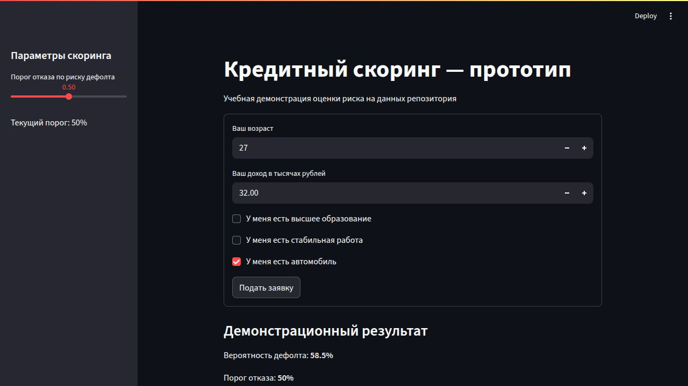

# Credit Scoring App

Личный учебный прототип: подготовка признаков, сравнение двух классификаторов,
оценка на отложенной выборке и прогноз через Streamlit или FastAPI.
Это демонстрация работы с моделью, а не банковская система принятия решений.



## Запуск

Проверено на Python 3.12. Зависимости приложения в `requirements.txt` и
`pyproject.toml` согласованы; `uv.lock` фиксирует также транзитивные зависимости.

```bash
uv sync --locked
uv run --locked streamlit run app.py
```

Без uv:

```bash
python3.12 -m venv .venv
source .venv/bin/activate
python -m pip install -r requirements.txt
python -m streamlit run app.py
```

Открыть [localhost:8501](http://localhost:8501). Форма загружает включённый
`model.pkl`; отдельный запуск API ей не нужен. После переобучения перезапустите
Streamlit и API, чтобы они загрузили новый файл модели.

Docker запускает ту же форму:

```bash
docker compose up --build
```

## Воспроизведение обучения

```bash
uv run --locked python train.py
```

`train.py` читает `data/scoring.csv` (180 093 строки). Общая функция в
`features.py` рассчитывает восемь признаков из пяти исходных полей. Отдельный
`prepare.py` не требуется. `data/scoring_features.csv` сохранён как исходный
подготовленный набор для сверки; при обучении производные признаки вычисляются
заново из raw-данных.

Порядок признаков: `log_income`, `age`, `age_sq`, `income_per_age`,
`employed_educated`, `education`, `work`, `car`. Формулы: `log1p(income)`,
`age²`, `income / age`, `work × education`; остальные поля передаются напрямую.
Эту же функцию используют Streamlit и API.

Разбиение — 80% train / 20% test, со стратификацией и `random_state=42`.
Логистическая регрессия и HistGradientBoosting сравниваются по ROC-AUC в
пятикратной кросс-валидации **только на train**. Масштабирование входит в Pipeline
и обучается внутри каждого fold. Победитель обучается на train и сохраняется
в `model.pkl`; test используется для итоговой оценки и описательного анализа
важности признаков, не для выбора модели.

В проверочном запуске 27.09.2026 выбран HistGradientBoosting: test ROC-AUC 0.602,
precision 0.145, recall 0.649, F1 0.237 при пороге 0.5. Это показатели на данных
репозитория, не результат внедрения или оценка экономического эффекта.

## API

```bash
uv run --locked uvicorn service:app --host 127.0.0.1 --port 8000
```

```bash
curl -X POST http://127.0.0.1:8000/score \
  -H 'Content-Type: application/json' \
  -d '{"age":27,"income":32,"education":false,"work":false,"car":true}'
```

Ответ содержит `default_proba` (оценку класса `default=1`) и булево `approved`:
`true`, только если эта оценка меньше 0.5. В Streamlit порог можно менять;
для сравнения с API оставьте 0.5. API принимает возраст 18–100 и конечный
неотрицательный доход — те же границы формы. Отрицательный доход или возраст
вне диапазона возвращают HTTP 422.

## Проверки

```bash
uv run --locked python -m pytest -q
```

Для установки через pip: `python -m pip install -r requirements-dev.txt`, затем
`python -m pytest -q`.

Тесты проверяют совпадение рассчитанных признаков с подготовленным CSV,
успешный запрос к API с реальной моделью, смысл решения об одобрении,
границы входных данных, исключение test из выбора алгоритма и отправку формы
Streamlit с изменением порога. В тесте границы выборок сами CV-оценки заменены
фиксированными числами; полноценное обучение запускается отдельной командой выше.

## Ограничения

- Источник данных, период наблюдений и репрезентативность выборки в исходных
  материалах не описаны. Единица дохода в форме — тысячи рублей; отдельного
  словаря данных для её независимой проверки нет.
- ROC-AUC около 0.60 и низкая precision ограничивают практическую ценность модели.
  Вероятности не калиброваны; порог 0.5 демонстрационный, не выбран по стоимости
  ошибок или кредитной политике. Новая независимая внешняя выборка не проверялась.
- Возрастные границы формы шире диапазона данных обучения (21–72 года).
  Прогноз вне диапазона обучения не подтверждён отдельной оценкой.
- Авторизация, мониторинг, эксплуатационная надёжность и реальная выдача
  кредитов в этот прототип не входят. Надписи формы демонстрируют сценарий.
- `model.pkl` рассчитан на указанные версии библиотек. После изменения среды
  переобучите модель; не загружайте pickle-файлы из недоверенных источников.

## Структура

- `features.py` — общий расчёт восьми признаков;
- `train.py` — выбор модели на train, обучение, оценка, сохранение;
- `app.py` — Streamlit-форма;
- `service.py` — FastAPI, `POST /score`;
- `model.pkl` — модель после воспроизводимого обучения;
- `data/scoring.csv` — исходные поля и целевой класс;
- `data/scoring_features.csv` — сохранённый подготовленный набор для сверки;
- `tests/` — регрессионные проверки.
